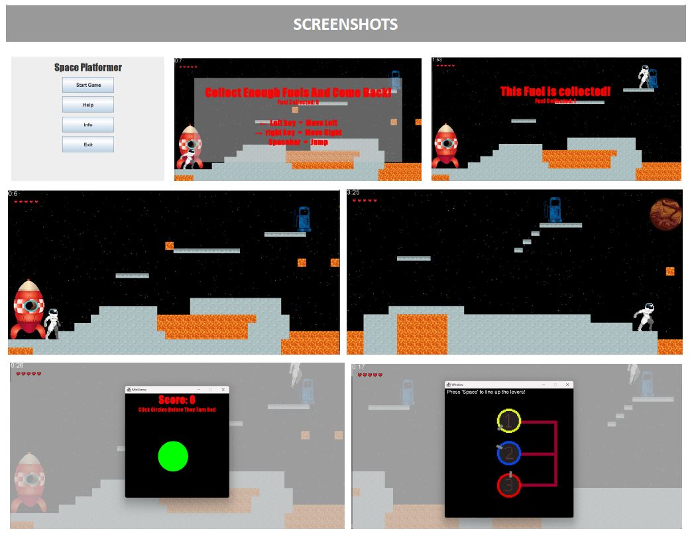

# 159261 Assignment 2 - Space Platformer Game

## Team Members
- Any Kwok
- Fynn Rollinson
- Greshka Lao
- Nathan Ploos Van Amstel

## Overview

In the game "Space Platformer Game," players guide an astronaut stranded on a planet, collecting fuel item through completing mini-games and avoiding obstacles. The goal is to gather enough fuel to progress through the Solar System.

### Features

#### Main Platform Game
- **Controls:** Arrow keys (left/right) for movement, down key for increased landing velocity, spacebar to jump, and escape key for pause menu.
- **Rules:**
  - Restricted to two jumps from the ground.
  - Collect fuel tanks to complete the game.
  - Start with five lives, losing one per collision with moving lava.
  - Game ends if the player falls into underground lava or runs out of lives.

#### Mini-Games
1. **Reaction Game:**
   - Click 15 circles before one turns red to complete the mini-game.
2. **Time-based Game:**
   - Align rotating bars in circles to red wires in numerical order to complete the mini-game.

## Screenshots

## References

### Sprites
- [Red Rocket Ship Vector](https://pngtree.com/freepng/red-rocket-ship_4729614.html)
- [Pixel art Planet](https://www.pngwing.com/en/free-png-iymqr/download)
- [Platformer Pack Redux](https://www.kenney.nl/assets/platformer-pack-redux)
- [Space-Based Shoot-'Em-Up Sprites](https://gamedevelopment.tutsplus.com/enjoy-these-totally-free-space-based-shoot-em-up-sprites--ga medev-2368a)
- [Textures Sprite Sheet](https://piiixl.itch.io/textures)
- [Vector Fuel Station Icon](https://pngtree.com/freepng/vector-fuel-station-icon_4237302.html)

### Music and Sound
- [Pixabay Sound Effects](https://pixabay.com/sound-effects/)
- [Zapsplat](https://www.zapsplat.com)
